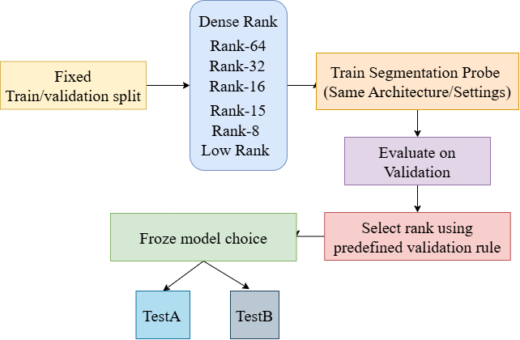

## Probing Task-Relevant Subspaces in Learned Visual Representations
*(A basic overview of scientific probe investigation by Abhinandan, JEPA Research Cohort 01)*

---

### Hypothesis
Let for the experimentation we choose *Null Hypothesis (H0)* and *Alternate Hypothesis (H1)* as, 

```
H0 = A rank-constrained representation does not preserve segmentation performance relative to the dense representation; reducing representation rank causes meaningful performance degradation. 

H1 = A sufficiently compact task-aligned rank-constrained representation can preserve segmentation performance relative to the dense representation, where preservation is operationally defined as a validation Dice within 1% relative difference from the Dense representation
```

Hence, to validate, we can put some set of questions in this direction as, 
1. **Compression**:
*How much can representation dimensionality be reduced before segmentation performance meaningfully degrades?*

2. **Task alignment**:
*Does the task-aligned low-rank representation outperform an unconstrained/parameter-matched low-rank representation?*

3. **Structural explanation**:
*Does the successful low-rank representation retain greater alignment with the dense representation and stronger class-discriminative structure?*

---

### Model Rank selection criteria
```
Select the smallest rank 'r' whose validation Dice is within ±1% of the Dense validation Dice. 
```
$$
\frac{\left|Dice_r - Dice_{\mathrm{Dense}}\right|}
{Dice_{\mathrm{Dense}}}
\leq 0.01
$$

---
### Tie Handling
If two or more than two ranks have qualify for the given criteria, then choose the smallest rank, 

$$
r^* = \min \{ r \mid \frac{|Dice_r - Dice_{\mathrm{Dense}}|}{Dice_{\mathrm{Dense}}} \leq 0.01 \}
$$

---
### Experimental Block Diagram



---
### Dataset Split
To validate the let hypothesis and extension of STELLAR, we choose [GlaS histopathology gland segmentation](https://www.kaggle.com/datasets/sani84/glasmiccai2015-gland-segmentation) dataset because it requires the representation to encode object identity, spatial context, object boundaries, local structure and separation between adjacent glands. Therefore, segmentation provides a relatively demanding test of whether spatially meaningful information is available in the representation. 

```
The dataset protocol uses 85 official training images, 60 TestA images, 20 TestB images. Training split consist of 70 images, validation split consist of 15 images.

For training data shuffling, SEED 42 has been utilized.
Split SEED 42, 123, 2026 has been used across all validation experimentation.
```
The original instance-level gland annotations are converted into binary semantic masks and the same deterministic train/validation protocol is used across experiments

---
### Full Probe Setting for Training purpose
#### Model Selection
For training, `STELLAR-B16` model has been utilized from [microsoft/STELLAR](https://github.com/microsoft/STELLAR) as, 
```
model = STELLARModel(
    num_sparse_tokens=cfg["num_sparse_tokens"],
    num_decoder_layers=cfg["num_decoder_layers"],
    spatial_temp=cfg["spatial_temp"],
    vit_pretrained=cfg["backbone"],
    do_recon=False,
    do_clustering=False,
    vq_model=None,
)
```

#### Learning Rate and Weighted Decay
For training purpose, `AdamW` optimizer with `learning rate 1e-3` and `weighted_decay 1e-4` has been utlized.
```
optimizer = torch.optim.AdamW(
    filter(lambda p: p.requires_grad, dense_model.parameters()),
    lr=1e-3,weight_decay=1e-4,)
```
Cross entropy loss has been utilized for model training purpose.
```
criterion = torch.nn.CrossEntropyLoss()
```

#### LR Scheduler and Batch Size
As the dataset is pretty much low in size, no LR schedular and Batch Size has been utilized. 

#### Preprocessing
`from torchvision.transforms import functional as TF`
Training image preprocessing,
```
# Training augmentation
def _train_transform(self, image, mask):
    width, height = TF.get_image_size(image)
    
    # Random crop scale
    scale = torch.empty(1).uniform_(self.crop_scale,1.0).item()

    crop_h = int(height * scale)
    crop_w = int(width * scale)

    crop_h = max(1, min(crop_h, height))
    crop_w = max(1, min(crop_w, width))

    # Random crop position
    if height == crop_h:
        top = 0
    else:
        top = torch.randint(0,height - crop_h + 1,(1,)).item()
        
    if width == crop_w:
        left = 0
    else:
        left = torch.randint(0,width - crop_w + 1,(1,)).item()

    # Image: bicubic
    image = TF.resized_crop(image,top,left,crop_h,crop_w,
        [self.resolution, self.resolution],
        interpolation=InterpolationMode.BICUBIC,)

    # Mask: nearest-neighbor
    mask = TF.resized_crop(mask.unsqueeze(0).float(),top,left,crop_h,crop_w,
        [self.resolution, self.resolution],
        interpolation=InterpolationMode.NEAREST,).squeeze(0).long()
    
    # Random horizontal flip
    if torch.rand(1).item() < 0.5:
        image = TF.hflip(image)
        mask = TF.hflip(mask)
    return image, mask
```

Validation/Test image preprocessing,
```
# Deterministic validation/test transform
def _eval_transform(self, image, mask):
    crop_res = int(self.resolution * 256 / 224)

    # Image: bicubic
    image = TF.resize(
        image,
        [crop_res, crop_res],
        interpolation=InterpolationMode.BICUBIC,
    )

    # Mask: nearest
    mask = TF.resize(
        mask.unsqueeze(0).float(),
        [crop_res, crop_res],
        interpolation=InterpolationMode.NEAREST,
    ).squeeze(0).long()

    # Center crop
    image = TF.center_crop(image,[self.resolution, self.resolution])
    mask = TF.center_crop(mask,[self.resolution, self.resolution])
    return image, mask
```

#### Maximum Epochs
For single and 3 SEED training purpose, model has been runned for `50 epochs`.

#### Early Stopping Criteria
No early stopping criteria has been utilized for this purpose. 

#### Checkpoint Selection
Before running, best checkpoint momery has been manually implemented as, 
```
best_val_dice = -1.0
best_epoch = -1
best_state = None
```
During training, validation's gland dice score compared with best validation dice score and based on that checkpoint has been saved.
```
if val_metrics["gland_dice"] > best_val_dice:
    best_val_dice = val_metrics["gland_dice"]
    best_epoch = epoch + 1
    best_state = {
        k: v.detach().cpu().clone()
        for k, v in dense_model.state_dict().items()
    }
```

---

### Rank Grid and SEEDs

| Model | Numerical Rank | Effective Rank |
| :--- | :---: | ---: |
| Dense Rank | 196 | 121.0593 |
| Rank-64 | 64 | 49.5979 |
| Rank-32 | 32 | 26.1495 |
| Rank-16 | 16 | 13.6316 |
| Rank-15 | 15 | 12.8390 |
| Rank-8 | 8 | 7.1487 |
| Low Rank | 24 | 8.0881 |

---

### Metric Hierarchy
Primary metric for validation during training is `Gland_Dice`. Where,

$$
Dice = \frac{2|P \cap G|}{|P| + |G|}
$$

P is predicted segmentation, G is ground truth segmentation.
Secondary metric that has been utilized during testing are `IoU` and `mIoU`. Where,

$$
IoU = \frac{|P \cap G|}{|P \cup G|}
$$

$$
mIoU = \frac{1}{C}\sum_{c=1}^{C} \mathrm{IoU}_c
$$

---

### Low-Rank Construction
For creating low-rank model, a rank truncation backbone has been utilized. 
```
def truncate_spatial_rank(features, rank):
    """
    features: [B, N, C]
    N = spatial tokens
    C = feature dimension
    """
    B, N, C = features.shape
    output = []
    
    for b in range(B):
        X = features[b].float()
        
        # Center across spatial locations
        X_mean = X.mean(dim=0, keepdim=True)
        X_centered = X - X_mean

        # SVD
        U, S, Vh = torch.linalg.svd(X_centered,full_matrices=False)
        r = min(rank, S.shape[0])
        X_r = (U[:, :r] @ torch.diag(S[:r]) @ Vh[:r, :])

        # Restore mean
        X_r = X_r + X_mean
        output.append(X_r)
        
    return torch.stack(output)
```
```
class RankTruncatedBackbone(torch.nn.Module):
    def __init__(self, backbone, rank):
        super().__init__()
        self.backbone = backbone
        self.rank = rank

    def encode(self, inputs):
        outputs = self.backbone.encode(inputs)
        dense = outputs["dense"]
        dense_rank = truncate_spatial_rank(dense,self.rank)
        outputs = dict(outputs)
        outputs["dense"] = dense_rank
        return outputs
```

Let say, we want to construct Rank-32 model. Hence,
```
from src.models.downstream.segmentation import SegmentationProbing

rank32_backbone = RankTruncatedBackbone(model,rank=32)

rank32_model = SegmentationProbing(
    model_backbone=rank32_backbone,
    is_baseline=False,
    feature_key="dense",
    feature_dim=768,
    num_classes=2,
    freeze_backbone=True,
    freeze_model=False,
    resize_output=(224, 224),
).to(device)
```

---
### H1 Failure Criterion

H1 is considered unsupported if no candidate rank below the Dense rank satisfies the predefined 1% relative-Dice preservation criterion. Hence, 
For all rank r, if 

$$
\frac{|Dice_r - Dice_{\mathrm{Dense}}|}{Dice_{\mathrm{Dense}}} > 0.01
$$

